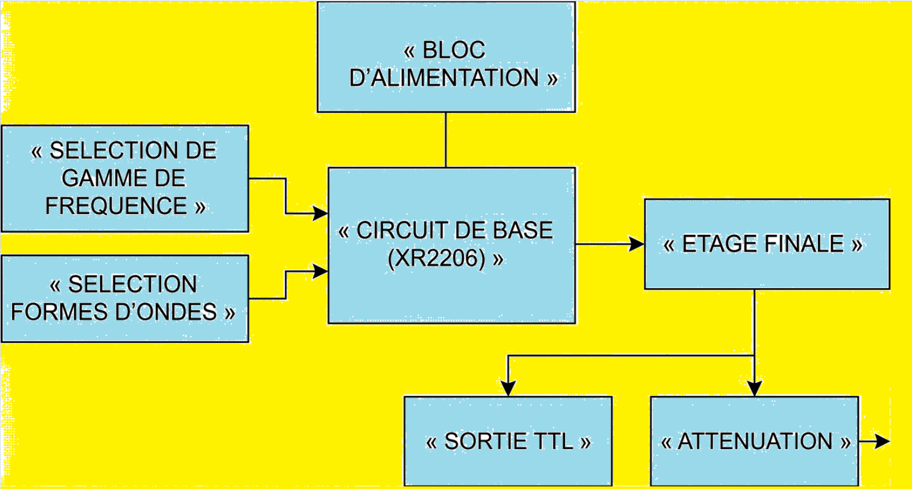

# XR-2206 Function Generator

> Monolithic function generator · Sine / Triangle / Square · ~0 Hz – 100 kHz · ±12 V dual-rail supply  
> TTL output · −20 / −40 / −60 dB attenuation · DC offset  
> **La Cité collégiale — 027930 TEC · Winter 2026**

---

## Block Diagram



---

## Full Schematic


> Schematic produced in **DesignSpark PCB** — see [`docs/`](docs/) for full-resolution export.

---

## Photos

| Annotated Breadboard | Clean Build |
|---|---|
|  |  |

---

## Specifications

| Parameter | Value |
|-----------|-------|
| Core IC | XR-2206 (EXAR) monolithic function generator |
| Waveforms | Sine · Triangle · Square |
| Frequency range | ~0 Hz – ~100 kHz (4 switched decades) |
| Frequency control | RV5 (1 MΩ pot) — CW = frequency ↑ |
| Max output amplitude | Sine: **21 Vpp** · Triangle: **22.5 Vpp** · Square: **23 Vpp** |
| Min output amplitude | 0 Vpp |
| Amplitude control | RV2 (50 kΩ pot) — CW = amplitude ↑ |
| THD (sine) | < 0.5 % after RV1 / RV3 trim |
| Attenuation steps | −20 dB · −40 dB · −60 dB (combinable) |
| Output impedance | ~50 Ω (maintained across all attenuation levels) |
| TTL output | 0 V / +5 V square wave — always active |
| DC Offset | Adjustable, switched via DPDT |
| Supply rails | +12 V (LM7812) · −12 V (LM741A tracking) · +5 V (LM7805) |
| Mains input | 120 Vac → 25 Vrms (transformer) |
| Platform | Breadboard prototype |
| Documentation | Service Manual MS-GEN-001 v1.0 · User Manual MU-GEN-001 v1.0 |

---

## System Architecture

The generator is divided into **5 interdependent subsystems**:

```
                   ┌─────────────────────┐
                   │    POWER SUPPLY     │
                   │  120Vac → ±12V/+5V  │
                   └──────────┬──────────┘
                              │
       ┌──────────────────────┼──────────────────┐
       │                      │                  │
┌──────▼─────────┐  ┌─────────▼────────┐  ┌──────▼──────┐
│  FREQ RANGE    │  │  XR-2206 CORE    │  │  WAVEFORM   │
│  SELECT        │─►│  f₀ = 1/(R×C)    │◄─│  SELECT     │
│  C1–C4 + DPDT  │  │  IC1             │  │  DPDT sw.   │
└────────────────┘  └─────────┬────────┘  └─────────────┘
                              │
               ┌──────────────┼──────────────┐
               │                             │
     ┌─────────▼──────────┐      ┌──────────▼──────────┐
     │   OUTPUT STAGE     │      │   TTL OUTPUT        │
     │  LM741A (gain −3)  │      │  2N3904 + 74LS00    │
     │  RV2 amplitude     │      │  0V / 5V square     │
     │  DC offset (DPDT)  │      └─────────────────────┘
     └─────────┬──────────┘
               │
     ┌─────────▼──────────┐
     │  ATTENUATION NET   │
     │  −20/−40/−60 dB    │
     │  R100–R106 ~50 Ω   │
     └─────────┬──────────┘
               │
            OUTPUT
```

---

## Subsystem Details

### 1 · Power Supply

| Stage | Components | Output |
|-------|-----------|--------|
| Step-down | Transformer | 120 Vac → 25 Vrms |
| Rectification | D100 + D101 (1N4005) full-wave | Raw ~±18 Vdc |
| Filtering | C_filter × 2 (1000 µF @ 63 V) | Smoothed ±18 V |
| +12 V regulation | LM7812 (IC5) | +12.0 Vdc |
| −12 V tracking | LM741A (IC3) inverter + RV100 (10 kΩ) | −12.0 Vdc ±20 mV |
| +5 V regulation | LM7805 (IC6) | +5.0 Vdc (TTL section) |

**Tracking supply trim:** Adjust **RV100** until `|+12 V| = |−12 V|` within ±20 mV measured at TP1 and TP2.

---

### 2 · XR-2206 Core (Signal Generation)

Oscillation frequency:

```
f₀ = 1 / (R × C)
```

**R** = R1 (100 kΩ) + RV5 (1 MΩ) · **C** = active range capacitor selected by DPDT switch.

**Frequency Ranges:**

| Switch | Capacitor | Range |
|--------|-----------|-------|
| Black DPDT 4 | C1 = 0.1 µF | 0 Hz – ~100 Hz |
| Black DPDT 3 | C2 = 0.01 µF | ~100 Hz – ~1 kHz |
| Black DPDT 2 | C3 = 0.001 µF | ~1 kHz – ~10 kHz |
| Black DPDT 1 | C4 = 0.1 µF | ~10 kHz – ~100 kHz |

> Only one range switch must be active at a time.

**Sine distortion trim:** Adjust **RV1** (RA = 1 MΩ) and **RV3** (RB = 25 kΩ) alternately at 1 kHz until THD < 0.5 %. Verify on oscilloscope.

---

### 3 · Output Stage & DC Offset

- **IC3 (LM741A)** — inverting amplifier, gain = −3 → ~21 Vpp sine max
- **RV2 (50 kΩ)** — amplitude control (CW = ↑)
- **DC Offset** — RV6 × 2 (10 kΩ each) resistive network on +12 V / −12 V rails, switched via DPDT. Use oscilloscope in **DC coupling** to observe offset.

---

### 4 · TTL Output

```
XR-2206 pin 11 (square wave)
        │
  R_B (400 Ω) ── Base of Q500 (2N3904)
        │
  Q500 saturates → inverts → 0 V / 5 V
        │
  74LS00 (IC4) — two NAND gates in parallel
        │
  TTL OUTPUT: 0 V / +5 V, doubled drive current
```

Active whenever the circuit is powered, regardless of main output waveform selection.

---

### 5 · Attenuation Network

Resistive ladder (R100–R106), ~50 Ω output impedance at all settings.

| White DPDT 1 | White DPDT 2 | Attenuation |
|-------------|-------------|-------------|
| OFF | OFF | 0 dB |
| ON | OFF | −20 dB |
| OFF | ON | −40 dB |
| ON | ON | −60 dB |

- −20 dB: R100/R101/R102 = 510 Ω (series), R103 = 390 Ω (shunt)
- −40 dB: R104/R105 = 510 Ω (series), R106 = 380 Ω (shunt)

---

## Bill of Materials

### Integrated Circuits

| Ref | Part | Function |
|-----|------|----------|
| IC1 | XR-2206 | Monolithic function generator |
| IC3 (×4) | LM741A | Output stage · Tracking supply |
| IC4 | 74LS00 | Quad NAND — TTL output buffer |
| IC5 | LM7812 | +12 V linear regulator |
| IC6 | LM7805 | +5 V linear regulator |

### Transistors & Diodes

| Ref | Part | Function |
|-----|------|----------|
| Q500 | 2N3904 NPN | TTL level converter |
| D100 / D101 | 1N4005 | Full-wave rectifier |

### Potentiometers

| Ref | Value | Function |
|-----|-------|----------|
| RV1 | 1 MΩ | Sine distortion trim (RA) |
| RV2 | 50 kΩ | Output amplitude control |
| RV3 | 25 kΩ | Sine symmetry trim (RB) |
| RV4 | 1 kΩ | Sine shaping network |
| RV5 | 1 MΩ | Frequency dial |
| RV6 (×2) | 10 kΩ | DC offset adjust |
| RV7 | 20 kΩ | Comparator threshold |
| RV100 | 10 kΩ | Tracking supply gain trim |

### Resistors

| Ref | Value | Function |
|-----|-------|----------|
| R1 | 100 kΩ — ¼ W | XR-2206 pin 7 timing |
| R2 | 30 kΩ — ¼ W | XR-2206 timing |
| R3 | 1 kΩ — ¼ W | XR-2206 timing |
| R4 / R5 / R6 | 10 kΩ — ¼ W (×3) | Biasing |
| R_B | 400 Ω — ¼ W | Q500 base current limit |
| R_C | 1 kΩ — ¼ W | Q500 collector load |
| R100–R102 | 510 Ω — ¼ W (×3) | −20 dB attenuation series |
| R103 | 390 Ω | −20 dB attenuation shunt |
| R104–R105 | 510 Ω — ¼ W (×2) | −40 dB attenuation series |
| R106 | 380 Ω | −40 dB attenuation shunt |

### Capacitors

| Ref | Value | Function |
|-----|-------|----------|
| C1 | 0.1 µF non-polar | Frequency range 0–100 Hz |
| C2 | 0.01 µF non-polar | Frequency range 100 Hz–1 kHz |
| C3 | 0.001 µF non-polar | Frequency range 1–10 kHz |
| C4 | 0.1 µF non-polar | Frequency range 10–100 kHz |
| C_filter (×2) | 1000 µF @ 63 V | Power supply bulk filter |
| C_bypass | 10 µF / 1 µF / 0.1 µF | IC decoupling |

### Switches

| Type | Qty | Function |
|------|-----|----------|
| DPDT black | 4 | Frequency range selection |
| DPDT grey #1 | 1 | Sine output select |
| DPDT grey #2 | 1 | Triangle output select |
| DPDT black #3 | 1 | Square output select |
| DPDT (DC offset) | 1 | DC offset on/off |
| DPDT white | 2 | −20 dB / −40 dB attenuation |

---

## Test Points & Nominal Voltages

| Test Point | Signal | Nominal | Tolerance |
|-----------|--------|---------|-----------|
| TP1 — V+ supply | +12 V DC | +12.0 V | ±5 % |
| TP2 — V− supply | −12 V DC | −12.0 V | ±5 % |
| TP3 — TTL supply | +5 V DC | +5.0 V | ±5 % |
| TP4 — XR-2206 pin 11 | Square wave | ~17 Vpp | ±5 % |
| TP5 — XR-2206 pin 2 (sine) | Sine wave | ~6.52 Vpp | ±5 % |
| TP6 — XR-2206 pin 2 (triangle) | Triangle wave | ~12.8 Vpp | ±5 % |
| TP10 — Main output (0 dB) | Full amplitude | ~21 Vpp sine max | ±5 % |
| TP11 — Output −20 dB | Attenuated | TP10 ÷ 10 | ±5 % |
| TP12 — Output −40 dB | Attenuated | TP10 ÷ 100 | ±5 % |
| TP13 — Output −60 dB | Attenuated | TP10 ÷ 1000 | ±5 % |

---

## Calibration Procedures

### Frequency Calibration
1. Connect oscilloscope to main output
2. Activate one frequency range DPDT (one only)
3. Select sine waveform
4. Rotate **RV5** — verify frequency varies smoothly across the range
5. Log measured min/max per range

### Amplitude Calibration
1. Rotate **RV2** full CW — verify max Vpp per spec table
2. Rotate full CCW — verify output reaches 0 Vpp

### Sine Distortion Trim
1. Set 1 kHz, full amplitude, sine selected
2. Adjust **RV1 (RA)** for minimum visible distortion
3. Fine-adjust **RV3 (RB)** — alternate iteratively
4. Target: THD < 0.5 %

### Tracking Supply Trim
1. Measure TP1 and TP2 with DMM
2. Adjust **RV100** until |TP1| = |TP2| within ±20 mV

---

## Troubleshooting Guide

| Symptom | Probable Cause | Diagnostic Procedure |
|---------|---------------|---------------------|
| No output | Power absent · IC1 faulty | Check TP1 → TP2 → TP3 → TP4 in sequence |
| Frequency fixed | RV5 open · range cap faulty | Measure RV5; test C1–C4 with LCR meter |
| Amplitude fixed at max | RV2 shorted | Measure across RV2 terminals |
| Sine distorted | RV1/RV3 misadjusted | Alternate RV1/RV3 trim; if no improvement replace IC1 |
| Wrong waveform | Multiple waveform switches active | Disable all; activate one only |
| No TTL output | +5 V absent · Q500 faulty | Check TP3; verify Q500 pinout; check 74LS00 supply |
| No −20 dB | R103 (390 Ω) open | Probe across R103 under signal |
| No −40 dB | R106 (380 Ω) open | Probe across R106 under signal |

---

## Measured Results

| Parameter | Sine | Triangle | Square |
|-----------|------|----------|--------|
| Max amplitude (Vpp) | 21 | 22.5 | 23 |
| Min amplitude (Vpp) | 0 | 0 | 0 |
| Range 1 | 0–100 Hz | 0–100 Hz | 0–100 Hz |
| Range 2 | 100 Hz–1 kHz | 100 Hz–1 kHz | 100 Hz–1 kHz |
| Range 3 | 1–10 kHz | 1–10 kHz | 1–10 kHz |
| Range 4 | 10–100 kHz | 10–100 kHz | 10–100 kHz |

---

## Problems Encountered & Solutions

| Problem | Root Cause | Solution |
|---------|-----------|---------|
| Excessive sine distortion | RV1/RV3 not trimmed | Alternating RA/RB adjustment until THD < 0.5 % |
| Asymmetric ±12 V | Tracking supply gain offset | Adjusted RV100 until |+12 V| = |−12 V| ±5 mV |
| TTL output inverted | 2N3904 inverts signal | Added two paralleled NAND gates (74LS00) to restore phase |

---

## Future Improvements

- Replace breadboard with a **PCB** to eliminate parasitic capacitance
- Add a **digital frequency counter display** for real-time readout
- Implement **AM modulation** via XR-2206 pin 1 with external signal
- Add a **front panel enclosure** with silk-screened labels

---

## Documentation

| Document | Reference | Description |
|----------|-----------|-------------|
| Service Manual | MS-GEN-001 v1.0 | Maintenance, calibration, fault diagnosis, repair procedures |
| User Manual | MU-GEN-001 v1.0 | Operating procedures, specifications, safety |
| Design Report | 027930 TEC | Full BOM, theory of operation, measured results |
| Schematic | DesignSpark PCB | `docs/schematic.png` |
| Block Diagram | — | `docs/block_diagram.png` |

---

## Tools Used

| Tool | Purpose |
|------|---------|
| DesignSpark PCB | Schematic capture |
| Multisim | Circuit simulation |
| Digital oscilloscope (≥100 MHz) | Waveform verification, THD, frequency |
| DMM (4½ digit) | DC voltage, resistance |
| Adjustable bench supply (Goldstar) | Circuit powering during test |
| LCR meter | Capacitor verification |

---

## Skills Demonstrated

`XR-2206` `Monolithic analog IC design` `Dual-rail power supply` `LM7812 / LM7805 regulation` `Tracking supply` `Op-amp inverting amplifier` `Resistive attenuation` `TTL logic` `2N3904 switch` `74LS00 NAND` `Oscilloscope (FFT)` `THD minimisation` `DesignSpark PCB` `Multisim` `IPC-A-610` `Technical documentation (EN/FR)`

---

*Adam Zaghloul · La Cité collégiale · Winter 2026 · [adamzaghloul07@gmail.com](mailto:adamzaghloul07@gmail.com) · [Portfolio](https://v0-adamzaghloul.vercel.app)*
