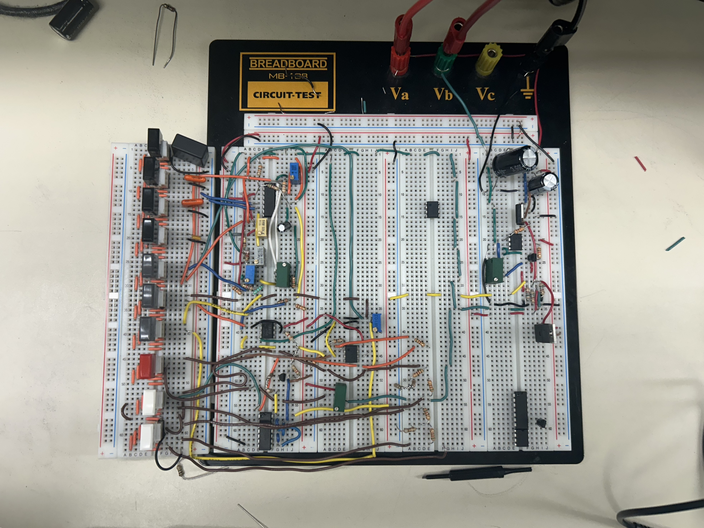
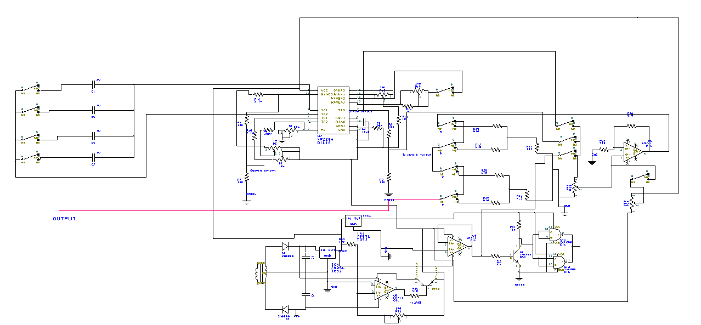
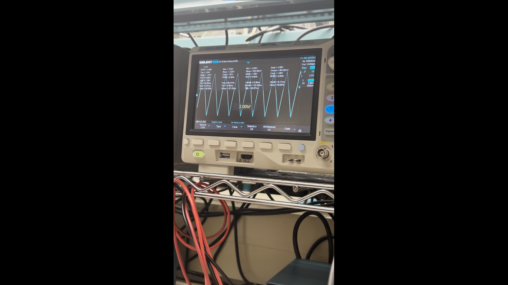

# XR-2206 Function Generator

> Monolithic function generator · Sine · Triangle · Square · ~0 Hz – ~100 kHz  
> ±12 V / +5 V triple-rail supply · TTL output · −20 / −40 / −60 dB attenuation · DC offset  
> **La Cité collégiale — 027930 TEC · Hiver 2026**

---

## Photos

| Annotated Breadboard | Final Build |
|---|---|
|  |  |

---

## Schematic & Block Diagram

| Full Schematic (DesignSpark PCB) | Block Diagram |
|---|---|
|  |  |

---

## Demo

[](https://youtu.be/lvYiISaXAnE)
*Click the thumbnail to watch the demonstration Video*

---

## Overview

A fully functional benchtop function generator built around the **XR-2206 monolithic function generator IC** (EXAR). Designed from the datasheet, prototyped on breadboard across **8 progressive lab sessions**, and documented to industry standards — including a complete **Service Manual** (MS-GEN-001 v1.0) and **User Manual** (MU-GEN-001 v1.0), both authored in French and English.

Each of the 6 sub-systems was built and validated independently with an oscilloscope and DMM before integration into the full circuit.

---

## Specifications

| Parameter | Value |
|---|---|
| Core IC | XR-2206 (EXAR) |
| Waveforms | Sine · Triangle · Square |
| Frequency range | ~0 Hz – ~100 kHz (4 switchable decades) |
| Frequency control | RV5 (1 MΩ) — clockwise = frequency ↑ |
| Max output amplitude | Sine: **21 Vpp** · Triangle: **22.5 Vpp** · Square: **23 Vpp** |
| Min output amplitude | 0 Vpp |
| Amplitude control | RV2 (50 kΩ) — clockwise = amplitude ↑ |
| THD (sine) | < 0.5 % after RV1 / RV3 trim |
| Attenuation | −20 dB · −40 dB · −60 dB (combinable) |
| Output impedance | ~50 Ω (constant across all attenuation settings) |
| TTL output | 0 V / +5 V square wave — always active |
| DC offset | Adjustable via DPDT + RV6 (2× 10 kΩ) |
| Supply rails | +12 V (LM7812) · −12 V (LM741A tracking) · +5 V (LM7805) |
| Supply symmetry | \|+12 V\| = \|−12 V\| ±20 mV — trimmed by RV100 |
| Mains input | 120 Vac → 25 Vrms transformer |
| Operating conditions | 0–40 °C · Humidity < 70 % |
| Platform | Breadboard prototype |
| Documentation | MS-GEN-001 v1.0 · MU-GEN-001 v1.0 |

---

## System Architecture

```

                   ┌─────────────────────┐
                   │    POWER SUPPLY     │
                   │  120Vac → ±12V/+5V  │
                   └──────────┬──────────┘
                              │
       ┌──────────────────────┼──────────────────┐
       │                      │                  │
┌──────▼─────────┐  ┌─────────▼────────┐  ┌──────▼──────┐
│  FREQ RANGE    │  │  XR-2206 CORE    │  │  WAVEFORM   │
│  SELECT        │─►│  f₀ = 1/(R×C)    │◄─│  SELECT     │
│  C1–C4 + DPDT  │  │  IC1             │  │  DPDT sw.   │
└────────────────┘  └─────────┬────────┘  └─────────────┘
                              │
               ┌──────────────┼──────────────┐
               │                             │
     ┌─────────▼──────────┐      ┌──────────▼──────────┐
     │   OUTPUT STAGE     │      │   TTL OUTPUT        │
     │  LM741A (gain −3)  │      │  2N3904 + 74LS00    │
     │  RV2 amplitude     │      │  0V / 5V square     │
     │  DC offset (DPDT)  │      └─────────────────────┘
     └─────────┬──────────┘
               │
     ┌─────────▼──────────┐
     │  ATTENUATION NET   │
     │  −20/−40/−60 dB    │
     │  R100–R106 ~50 Ω   │
     └─────────┬──────────┘
               │
            OUTPUT

```

---

## Sub-System Details

### 1 — Power Supply

| Stage | Components | Output |
|---|---|---|
| Step-down | 120 Vac transformer | 25 Vrms |
| Rectification | D100 + D101 (1N4005) full-wave | Raw ≈ ±18 Vdc |
| Filtering | C_filtre × 2 (1000 µF @ 63 V) | Smoothed ±18 V |
| +12 V regulation | LM7812 (IC5) | +12.0 Vdc |
| −12 V tracking | LM741A (IC3) inverter + RV100 (10 kΩ) | −12.0 Vdc ±20 mV |
| +5 V regulation | LM7805 (IC6) | +5.0 Vdc |

> **Tracking supply trim:** Adjust **RV100** until `|TP1| = |TP2|` within ±20 mV.

---

### 2 — Signal Generation (XR-2206)

Oscillation frequency:

```
f₀ = 1 / (R × C)
```

**R** = R1 (100 kΩ) + RV5 (1 MΩ) · **C** = active range capacitor (C1–C4).

**Frequency Ranges:**

| Black Button | Capacitor | Range |
|---|---|---|
| 4th (rightmost) | C1 = 0.1 µF | 0 Hz – ~100 Hz |
| 3rd | C2 = 0.01 µF | ~100 Hz – ~1 kHz |
| 2nd | C3 = 0.001 µF | ~1 kHz – ~10 kHz |
| 1st (leftmost) | C4 = 0.1 µF | ~10 kHz – ~100 kHz |

> Activate **one** range button at a time.

**Sine distortion trim:**  
Alternate **RV1 (RA = 1 MΩ)** and **RV3 (RB = 25 kΩ)** at 1 kHz until THD < 0.5 %.  
**RV4 (1 kΩ, R_shape)** fine-trims the sine shaping network.

**Measured signal levels at XR-2206 pin 2:**
- Sine: ~6.52 Vpp
- Triangle: ~12.8 Vpp
- Square (pin 11): ~17 Vpp

---

### 3 — Output Stage & DC Offset

- **LM741A (IC3)** — inverting amplifier, gain = −3 → ~20 Vpp max at output
- **RV2 (50 kΩ)** — amplitude control (CW = ↑)
- **DC Offset** — voltage divider on +12 V / −12 V rails, trimmed by **RV6 (2× 10 kΩ)**, switched via dedicated DPDT
- Use oscilloscope in **DC coupling** to observe offset; **AC coupling** to measure amplitude only

---

### 4 — TTL Output

```
XR-2206 pin 11 (square wave ~17 Vpp)
        │
  R_B (400 Ω) ──► Base of Q500 (2N3904) — saturation switch
        │
  Collector output → inverted TTL level
        │
  74LS00 (IC4) — 2× NAND gates in parallel
        │
  TTL OUTPUT: 0 V / +5 V · doubled drive current · re-inverted to correct phase
```

Active whenever the circuit is powered — independent of main output waveform selection.

---

### 5 — Attenuation Network

Resistive ladder (R100–R106) maintains **~50 Ω output impedance** at all settings.

| White DPDT 1 | White DPDT 2 | Attenuation | Network |
|---|---|---|---|
| OFF | OFF | 0 dB | — |
| ON | OFF | −20 dB | R103 = 390 Ω shunt |
| OFF | ON | −40 dB | R106 = 380 Ω shunt |
| ON | ON | −60 dB | Both stages combined |

---

## Bill of Materials

### ICs · Transistors · Diodes

| Ref | Part | Function | Qty |
|---|---|---|---|
| IC1 | XR-2206 (EXAR) | Monolithic function generator | 1 |
| IC3 | LM741A | Op-amp — output stage, tracking supply | 4 |
| IC4 | 74LS00 | Quad NAND — TTL output buffer | 1 |
| IC5 | LM7812 | +12 V linear regulator | 1 |
| IC6 | LM7805 | +5 V linear regulator | 1 |
| Q500 | 2N3904 NPN | TTL saturation switch | 1 |
| D100/D101 | 1N4005 | Full-wave rectifier diodes | 2 |

### Potentiometers

| Ref | Value | Function |
|---|---|---|
| RV1 | 1 MΩ | Sine distortion trim (RA) |
| RV2 | 50 kΩ | Output amplitude control |
| RV3 | 25 kΩ | Sine symmetry trim (RB) |
| RV4 | 1 kΩ | Sine shaping network (R_shape) |
| RV5 | 1 MΩ | Frequency dial (continuous) |
| RV6 | 10 kΩ × 2 | DC offset — output stage |
| RV7 | 20 kΩ | Comparator threshold |
| RV100 | 10 kΩ | Tracking supply gain trim |

### Resistors (¼ W)

| Ref | Value | Function |
|---|---|---|
| R1 | 100 kΩ | XR-2206 pin 7 timing |
| R2 | 30 kΩ | XR-2206 timing |
| R3 | 1 kΩ | XR-2206 timing |
| R4 / R5 / R6 | 10 kΩ (×3) | Miscellaneous biasing |
| R_B | 400 Ω | Q500 base current limiting |
| R_C | 1 kΩ | Q500 collector load |
| R100–R102 | 510 Ω (×3) | −20 dB attenuation — series arms |
| R103 | 390 Ω | −20 dB attenuation — shunt arm |
| R104–R105 | 510 Ω (×2) | −40 dB attenuation — series arms |
| R106 | 380 Ω | −40 dB attenuation — shunt arm |

### Capacitors

| Ref | Value | Function |
|---|---|---|
| C1 | 0.1 µF (non-polar) | Frequency range 0–100 Hz |
| C2 | 0.01 µF (non-polar) | Frequency range 100 Hz–1 kHz |
| C3 | 0.001 µF (non-polar) | Frequency range 1–10 kHz |
| C4 | 0.1 µF (non-polar) | Frequency range 10–100 kHz |
| C_filtre × 2 | 1000 µF @ 63 V | Power supply bulk filter |
| C_bypass | 10 µF / 1 µF / 0.1 µF | IC decoupling |

### Switches

| Type | Qty | Function |
|---|---|---|
| DPDT black | 4 | Frequency range selection |
| DPDT grey #1 | 1 | Sine waveform select |
| DPDT grey #2 | 1 | Triangle waveform select |
| DPDT black #3 | 1 | Square waveform select |
| DPDT (DC offset) | 1 | DC offset on/off |
| DPDT white | 2 | −20 dB / −40 dB attenuation |

---

## Test Points & Nominal Values

| Test Point | Signal | Nominal | Tolerance |
|---|---|---|---|
| TP1 — V+ | +12 V DC | +12.0 V | ±5 % |
| TP2 — V− | −12 V DC | −12.0 V | ±5 % |
| TP3 — TTL supply | +5 V DC | +5.0 V | ±5 % |
| TP4 — XR-2206 pin 11 | Square wave | ~17 Vpp | ±5 % |
| TP5 — XR-2206 pin 2 (sine) | Sine | ~6.52 Vpp | ±5 % |
| TP6 — XR-2206 pin 2 (triangle) | Triangle | ~12.8 Vpp | ±5 % |
| TP8 — IC3 input | Selected waveform | — | ±5 % |
| TP9 — IC3 output | Amplified signal | — | ±5 % |
| TP10 — Main output (0 dB) | Sine max | ~21 Vpp | ±5 % |
| TP11 — Output −20 dB | Attenuated | TP10 ÷ 10 | ±5 % |
| TP12 — Output −40 dB | Attenuated | TP10 ÷ 100 | ±5 % |
| TP13 — Output −60 dB | Attenuated | TP10 ÷ 1000 | ±5 % |

---

## Operating Procedure

### Power-Up
1. Verify all breadboard connections are secure — no bent pins, no visible shorts
2. Connect supply; confirm **+12 V, −12 V, +5 V** at TP1–TP3 with DMM
3. Allow **2–3 minutes** warm-up before precision measurements

### Selecting Frequency & Waveform
- Activate **one** black range button → rotate **RV5** (CW = frequency ↑)
- Activate **one** waveform button: Grey #1 = Sine · Grey #2 = Triangle · Black #3 = Square
- Connect oscilloscope; set timebase to match expected period

### Amplitude, Attenuation & DC Offset
- **RV2** CW → amplitude ↑ (max: 21 / 22.5 / 23 Vpp by waveform)
- White buttons: 1st = −20 dB · 2nd = −40 dB · both = −60 dB
- DC offset DPDT → activates RV6; use **DC coupling** on oscilloscope to observe shift

### Power-Down
1. Reduce **RV2** to minimum (full CCW)
2. Deactivate all waveform and range buttons
3. Disconnect any load or instrument from output
4. Cut supply power
5. Wait **≥ 30 seconds** before touching filter caps (C_filtre discharge)

---

## Calibration

>  **Perform calibration with circuit powered**.

### Frequency (RV5)
1. Connect oscilloscope to main output; activate one range
2. Rotate RV5 across full travel; confirm frequency spans the expected decade
3. Log measured min/max with date

### Amplitude (RV2)
1. Rotate RV2 full CW → verify Vpp against spec table
2. Rotate full CCW → verify 0 Vpp
3. Log result

### Sine Distortion Trim (RV1 / RV3)
1. Set 1 kHz sine, full amplitude
2. Adjust **RV1 (RA)** for minimum visible distortion on oscilloscope
3. Refine with **RV3 (RB)** — alternate iteratively
4. Target: THD < 0.5 %

### Tracking Supply (RV100)
1. Measure TP1 and TP2 with DMM
2. Adjust **RV100** until |TP1| = |TP2| within ±20 mV

---

## Troubleshooting

| Symptom | Probable Cause | Action |
|---|---|---|
| No output | Supply absent · IC1 faulty · open component | Follow TP1 → TP2 → TP3 → TP4 → TP10 in sequence |
| Fixed frequency | RV5 open · range capacitor faulty | Measure RV5 resistance; test C1–C4 with LCR meter |
| Fixed max amplitude | RV2 shorted or mis-seated | Measure resistance across RV2 terminals |
| Distorted sine | RV1/RV3 misadjusted · IC1 degraded | Alternate RV1/RV3 trim; replace IC1 if no improvement |
| Wrong waveform | Multiple waveform buttons active | Deactivate all; activate one only |
| No TTL output | +5 V absent · Q500 faulty · IC4 unpowered | Check TP3; verify Q500 B/C/E wiring; check 74LS00 supply pins |
| No −20 dB attenuation | R103 (390 Ω) open | Probe both nodes of R103 under signal |
| No −40 dB attenuation | R106 (380 Ω) open | Probe both nodes of R106 under signal |
| Asymmetric supply | RV100 mis-trimmed | Measure TP1 and TP2; readjust RV100 |

---

## Measured Results

| Parameter | Sine | Triangle | Square |
|---|---|---|---|
| Max amplitude (Vpp) | 21 | 22.5 | 23 |
| Min amplitude (Vpp) | 0 | 0 | 0 |
| Range 1 | 0–100 Hz | 0–100 Hz | 0–100 Hz |
| Range 2 | 100 Hz–1 kHz | 100 Hz–1 kHz | 100 Hz–1 kHz |
| Range 3 | 1–10 kHz | 1–10 kHz | 1–10 kHz |
| Range 4 | 10–100 kHz | 10–100 kHz | 10–100 kHz |
| THD (sine) | < 0.5 % | — | — |

---

## Problems Encountered & Solutions

| Problem | Root Cause | Solution |
|---|---|---|
| Excessive sine distortion | RV1/RV3 not trimmed | Alternated RA/RB adjustment until THD minimum |
| Asymmetric −12 V supply | RV100 not adjusted | Trimmed RV100 until \|+12 V\| = \|−12 V\| to ±5 mV |
| TTL output inverted polarity | 2N3904 B/C/E mis-wired | Verified transistor pinout; corrected wiring |

---

## Preventive Maintenance

| Frequency | Task | Tool |
|---|---|---|
| Before each use | Verify +12 V / −12 V / +5 V at TP1–TP3 | DMM |
| Before each use | Visual inspection — all connections seated | Loupe |
| Monthly | Clean potentiometers with contact cleaner | Contact spray |
| Quarterly | Calibrate frequency (RV5) and amplitude (RV2) | Oscilloscope |
| Quarterly | Verify sine THD (RV1/RV3); trim if > 0.5 % | Oscilloscope |
| As needed | Replace defective components | Needle-nose pliers |

---

## Future Improvements

- Replace breadboard with a **PCB** to eliminate parasitic capacitance and intermittent contacts
- Add a **digital frequency counter display** for real-time readout
- Implement **AM modulation** via XR-2206 pin 1 with an external modulation signal
- House the circuit in a **labelled front-panel enclosure**

---

## Documentation

| Document | Reference | Language |
|---|---|---|
| Service Manual | MS-GEN-001 v1.0 | FR / EN |
| User Manual | MU-GEN-001 v1.0 | FR / EN |
| Design Report | 027930 TEC | FR |
| Schematic (DesignSpark PCB) | — | `docs/schematic.png` |
| Block Diagram | — | `docs/block-diagram.png` |

---

## Tools Used

| Tool | Purpose |
|---|---|
| DesignSpark PCB | Schematic capture |
| Multisim | Pre-build simulation |
| Digital oscilloscope (≥100 MHz) | Waveform verification, THD, frequency measurement |
| DMM (4½ digit) | DC voltages, resistance checks |
| Adjustable bench supply (Goldstar) | Circuit powering during test |
| LCR meter | Capacitor and inductor verification |

---

## Skills Demonstrated

`XR-2206` `Monolithic analog IC design` `Dual-rail linear power supply` `LM7812 / LM7805 regulation` `Tracking split supply` `LM741A op-amp — inverting amplifier` `Resistive attenuation network` `TTL logic — 74LS00 / 2N3904` `DC offset stage` `Oscilloscope (time-domain + FFT)` `THD minimisation` `DesignSpark PCB` `Multisim` `IPC-A-610` `Technical documentation (EN/FR)` `Fault isolation` `Preventive maintenance`

---

*Adam Zaghloul · La Cité collégiale · Hiver 2026 · [adamzaghloul07@gmail.com](mailto:adamzaghloul07@gmail.com) · [Portfolio](https://v0-adamzaghloul.vercel.app)*
